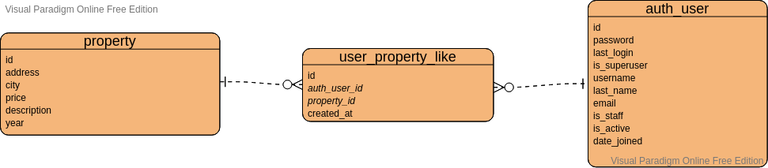

# 1. py_properties

## Dependecias / Tecnologias

- **[poetry](https://python-poetry.org/)**
- **[http](https://docs.python.org/3/library/http.server.html#)** module
- **[pytest](https://docs.pytest.org/en/stable/)**
- **[mysql-connector-python](https://dev.mysql.com/doc/connector-python/en/)**
- **[pre-commit](https://pre-commit.com/)**

## Información del proyecto

- Se utilizará el modulo http para hacer funcionar un servidor http.
    + La configuracion del servidor estará en el archivo `app/server.py`
- Se utilizará la libreria mysql connector para python para tener acceso a la base de datos.
    + La configuracion de conexion a la base de datos estará en el archivo `app/db_config.py`
    + En los casos dónde existan ids de propiedades duplicados se traerá la primer propiedad creada y se obviaran las demás.
    + Se excluiran las propiedades que no contengan dirección.
- Se usará pre-commit para tener un control más estricto del estandar pep8 y el orden de llamado de dependencias.
- las variables del entorno estarán en el archivo `.env` el cual estará excluido del repositorio por razones de seguridad.

## Uso de la API

1. Crear ambiente virtual: `python -m venv venv`
2. Instalar dependencias: `poetry install`
3. Iniciar el servidor HTTP: `python app/server.py 8000`
4. Uso de la API: `curl http://localhost:8000/`
    + La API se puede consultar con los siguientes filtros **year**, **city** y **status**
        * **Ejemplo:** `http://localhost:8000/?city=bogota&year=2000&status=en_venta`

# 2. Likes de usuarios a propiedades

Se creó una tabla llamada **user_property_like** la cual tiene dos llaves foraneas: **auth_user_id** y **property_id**; las dos llaves foraneas son relaciones de tipo many to one, **auth_user_id**  se relaciona con la tabla **auth_user** y **property_id** se relaciona con la tabla **property**.

Adicionalmente se agregó un UNIQUE Constraint llamado **unique_like** que garantiza que no haya redundancia de datos cuando un usuario dé o remueva el like de la propiedad.

## Diagrama



## Sentencia MySQL

``` sql
CREATE TABLE
  user_property_like (
    id int NOT NULL,
    auth_user_id int NOT NULL,
    property_id int NOT NULL,
    created_at datetime DEFAULT CURRENT_TIMESTAMP,
    PRIMARY KEY (id),
    FOREIGN KEY (auth_user_id) REFERENCES auth_user(id),
    FOREIGN KEY (property_id) REFERENCES property(id),
    CONSTRAINT unique_like UNIQUE (auth_user_id, property_id)
  );
```
